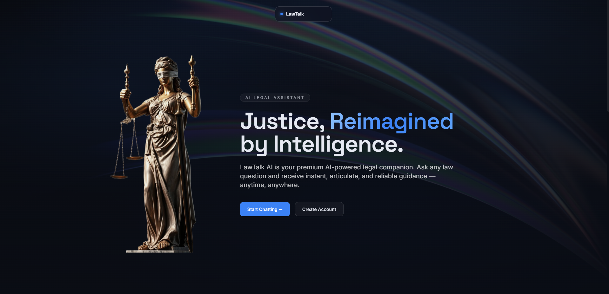
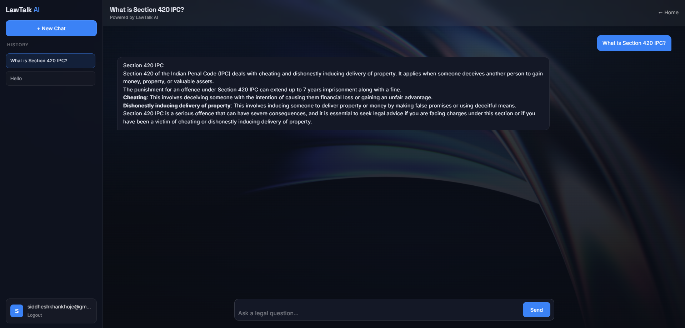
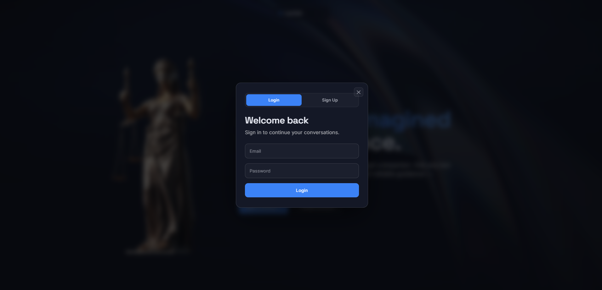
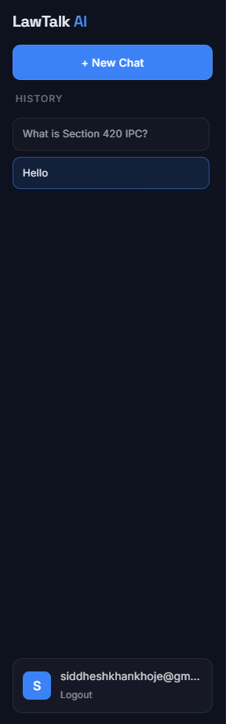

<div align="center">

# ⚖️ LawTalk AI

### *Your Intelligent Legal Assistant, Powered by RAG*

[](https://fastapi.tiangolo.com/)
[](https://python.org)
[](https://groq.com/)
[](https://supabase.com/)
[](https://faiss.ai/)
[](LICENSE)

<br/>

> **LawTalk AI** is an AI-powered legal assistant chatbot built on a Retrieval-Augmented Generation (RAG) pipeline. It retrieves semantically relevant context from embedded legal documents and generates grounded, citation-aware responses using state-of-the-art LLMs — significantly reducing hallucinations.

<br/>

</div>


---

## 📋 Table of Contents

- [Features](#-features)
- [Architecture Overview](#-architecture-overview)
- [Tech Stack](#-tech-stack)
- [Project Structure](#-project-structure)
- [Screenshots](#-screenshots)
- [Installation Guide](#-installation-guide)
- [Environment Variables](#-environment-variables)
- [API Documentation](#-api-documentation)
- [How RAG Works](#-how-rag-works)
- [Future Improvements](#-future-improvements)
- [Contributing](#-contributing)
- [License](#-license)
- [Contact](#-contact)

---

## ✨ Features

| Feature | Description |
|--------|-------------|
| 🤖 **AI Legal Chatbot** | Conversational assistant trained on legal documents and powered by Groq LLMs |
| 🔍 **RAG Pipeline** | Retrieval-Augmented Generation ensures responses are grounded in real legal context |
| ⚡ **FAISS Vector Search** | Ultra-fast semantic similarity search over embedded legal document chunks |
| 🧠 **Groq-Powered Responses** | Leverages Groq's blazing-fast inference API for real-time response generation |
| 🔐 **Supabase Authentication** | Secure user sign-up, login, and session management via Supabase Auth |
| 💾 **Persistent Chat History** | All conversations are stored and retrievable via Supabase Database |
| 🎨 **Glassmorphism UI** | Modern, frosted-glass aesthetic with smooth GSAP animations |
| 📜 **History Sidebar** | Browse and continue previous conversations with ease |
| 🛡️ **Reduced Hallucinations** | Contextual retrieval anchors LLM responses to real legal documents |
| 🌐 **REST API Backend** | Clean, documented FastAPI endpoints for easy integration or extension |

---

## 🏗️ Architecture Overview

```
┌──────────────────────────────────────────────────────────────────────┐
│                           USER BROWSER                               │
│                                                                      │
│   ┌─────────────────┐          ┌──────────────────────────────────┐  │
│   │  Landing Page   │          │         Chat Interface           │  │
│   │  (index.html)   │ ──────▶  │         (chat.html)              │  │
│   │  GSAP Animations│          │  History Sidebar + Chat Window   │  │
│   └─────────────────┘          └────────────┬─────────────────────┘  │
│                                             │                        │
│                              ┌──────────────▼──────────────┐        │
│                              │      Supabase Auth          │        │
│                              │  (Login / Signup / Session) │        │
│                              └──────────────┬──────────────┘        │
└─────────────────────────────────────────────┼────────────────────────┘
                                              │ POST /ask
                                              ▼
┌──────────────────────────────────────────────────────────────────────┐
│                        FASTAPI BACKEND                               │
│                                                                      │
│   ┌────────────────┐     ┌─────────────────┐    ┌────────────────┐  │
│   │  chat.py (API) │────▶│   rag.py        │───▶│ groq_client.py │  │
│   │  /ask endpoint │     │   RAG Pipeline  │    │  LLM Inference │  │
│   └────────────────┘     └────────┬────────┘    └────────────────┘  │
│                                   │                                  │
│                         ┌─────────▼──────────┐                      │
│                         │   embedder.py       │                      │
│                         │  Sentence Transform │                      │
│                         └─────────┬──────────┘                      │
│                                   │                                  │
│                         ┌─────────▼──────────┐                      │
│                         │   FAISS Index       │                      │
│                         │  (faiss_index/)     │                      │
│                         └────────────────────┘                      │
└──────────────────────────────────────────────────────────────────────┘
                                              │
                              ┌───────────────▼──────────────┐
                              │       Supabase DB            │
                              │  chats table + messages table│
                              └──────────────────────────────┘
```

---

## 🛠️ Tech Stack

### Frontend

| Technology | Purpose |
|-----------|---------|
| HTML5 | Page structure and markup |
| Tailwind CSS (CDN) | Utility-first responsive styling |
| Vanilla JavaScript | Frontend logic and API communication |
| GSAP | Smooth animations and transitions |
| Supabase JS SDK | Authentication and database client |

### Backend

| Technology | Purpose |
|-----------|---------|
| FastAPI | High-performance Python web framework |
| FAISS | Efficient vector similarity search |
| Sentence Transformers | Text embedding generation |
| Groq API | Ultra-fast LLM inference |
| Supabase | Auth provider and persistent chat storage |
| Python-dotenv | Environment variable management |

---

## 📁 Project Structure

```
LawTalk-AI/
│
├── backend/
│   └── app/
│       ├── api/
│       │   └── chat.py              # /ask endpoint — receives query, returns AI response
│       ├── core/
│       │   └── config.py            # Loads and validates environment variables
│       ├── models/
│       │   └── schemas.py           # Pydantic request/response schemas
│       ├── services/
│       │   ├── rag.py               # RAG pipeline: retrieve → prompt → generate
│       │   ├── embedder.py          # Sentence Transformer embedding logic
│       │   └── groq_client.py       # Groq API wrapper for LLM calls
│       └── main.py                  # FastAPI app entry point, CORS config
│
├── frontend/
│   ├── index.html                   # Landing page with GSAP animations
│   ├── chat.html                    # Main chat interface with history sidebar
│   ├── css/                         # Custom stylesheets
│   ├── js/                          # Frontend JavaScript modules
│   └── assets/                      # Images, icons, and static resources
│
├── faiss_index/                     # Pre-built FAISS vector index files
├── requirements.txt                 # Python dependencies
└── README.md
```

---

## 📸 Screenshots


| Landing Page | Chat Interface |
|:---:|:---:|
|  |  |

| Login / Signup | Chat History Sidebar |
|:---:|:---:|
|  |  |

---

## 🚀 Installation Guide

### Prerequisites

Ensure you have the following installed:

- Python 3.10+
- pip
- A modern browser (Chrome / Firefox / Edge)
- [Groq API Key](https://console.groq.com/)
- [Supabase Project](https://supabase.com/) with Auth enabled

---

### 1. Clone the Repository

```bash
git clone https://github.com/SiddheshK1704/LawTalk-AI_RAG_Chatbot.git
cd LawTalk-AI_RAG_Chatbot
```

### 2. Create a Virtual Environment

```bash
python -m venv venv

# On macOS/Linux
source venv/bin/activate

# On Windows
venv\Scripts\activate
```

### 3. Install Dependencies

```bash
pip install -r requirements.txt
```

### 4. Configure Environment Variables

Create a `.env` file in the `backend/` directory:

```bash
cp .env.example .env  # if example exists, or create manually
```

Populate it with your credentials (see [Environment Variables](#-environment-variables)).

### 5. Start the FastAPI Backend

```bash
cd backend
uvicorn app.main:app --reload --host 0.0.0.0 --port 8000
```

The API will be live at: `http://localhost:8000`

Interactive docs available at: `http://localhost:8000/docs`

### 6. Open the Frontend

Navigate to the `frontend/` directory and open `index.html` directly in your browser:

```bash
# macOS
open frontend/index.html

# Linux
xdg-open frontend/index.html

# Windows
start frontend/index.html
```

Or serve it with a simple local server:

```bash
cd frontend
python -m http.server 3000
# Then visit http://localhost:3000
```

---

## 🔐 Environment Variables

Create a `.env` file in the `backend/` directory with the following keys:

```env
# ─── Groq LLM API ───────────────────────────────────────────
GROQ_API_KEY=your_groq_api_key_here

# ─── Supabase ────────────────────────────────────────────────
SUPABASE_URL=https://your-project-id.supabase.co
SUPABASE_ANON_KEY=your_supabase_anon_key_here
```

| Variable | Required | Description |
|----------|----------|-------------|
| `GROQ_API_KEY` | ✅ Yes | API key from [console.groq.com](https://console.groq.com/) for LLM inference |
| `SUPABASE_URL` | ✅ Yes | Your Supabase project URL |
| `SUPABASE_ANON_KEY` | ✅ Yes | Supabase anonymous/public key for client-side access |

> ⚠️ **Never commit your `.env` file.** It is listed in `.gitignore` by default.

---

## 📡 API Documentation

### `POST /ask`

Submit a legal query and receive a RAG-generated response.

**Request**

```http
POST /ask
Content-Type: application/json
```

```json
{
  "query": "What are the rights of a tenant under Indian rental law?"
}
```

**Response**

```json
{
  "response": "Under Indian rental law, tenants have several protected rights including..."
}
```

**Status Codes**

| Code | Meaning |
|------|---------|
| `200 OK` | Successful response with AI-generated answer |
| `422 Unprocessable Entity` | Invalid or missing request body |
| `500 Internal Server Error` | LLM or retrieval pipeline failure |

**Interactive Docs**

Once the backend is running, visit:

```
http://localhost:8000/docs       ← Swagger UI
http://localhost:8000/redoc      ← ReDoc UI
```

---

## 🧠 How RAG Works

LawTalk AI uses a Retrieval-Augmented Generation pipeline to produce grounded, accurate legal responses. Here's the step-by-step flow:

```
User Query
    │
    ▼
┌─────────────────────────────────┐
│  1. EMBEDDING GENERATION        │
│  Sentence Transformers converts │
│  the query into a dense vector  │
│  representation (embedding).    │
└────────────────┬────────────────┘
                 │
                 ▼
┌─────────────────────────────────┐
│  2. FAISS VECTOR SEARCH         │
│  The query embedding is         │
│  compared against the pre-built │
│  FAISS index of chunked legal   │
│  documents using cosine         │
│  similarity. Top-k chunks are   │
│  retrieved as context.          │
└────────────────┬────────────────┘
                 │
                 ▼
┌─────────────────────────────────┐
│  3. CONTEXTUAL PROMPT BUILDING  │
│  Retrieved document chunks are  │
│  injected into a structured     │
│  prompt template alongside      │
│  the original user query.       │
└────────────────┬────────────────┘
                 │
                 ▼
┌─────────────────────────────────┐
│  4. GROQ LLM INFERENCE          │
│  The enriched prompt is sent    │
│  to the Groq API. The LLM       │
│  generates a contextually       │
│  grounded response, citing      │
│  only retrieved information.    │
└────────────────┬────────────────┘
                 │
                 ▼
         AI Response → User
```

**Why RAG over plain LLMs?**

| Plain LLM | LawTalk AI (RAG) |
|-----------|-----------------|
| Generates from training data only | Retrieves from real legal documents |
| High hallucination risk | Grounded responses from actual sources |
| No document-specific knowledge | Domain-specific legal context |
| Static knowledge cutoff | Extensible with updated documents |

---

## 🗄️ Supabase Schema

LawTalk AI uses two Supabase tables to persist chat data:

### `chats` table

| Column | Type | Description |
|--------|------|-------------|
| `id` | `uuid` | Primary key |
| `user_id` | `uuid` | Foreign key to Supabase Auth user |
| `title` | `text` | Auto-generated chat title |
| `created_at` | `timestamp` | Chat creation time |

### `messages` table

| Column | Type | Description |
|--------|------|-------------|
| `id` | `uuid` | Primary key |
| `chat_id` | `uuid` | Foreign key to `chats.id` |
| `role` | `text` | Either `"user"` or `"assistant"` |
| `content` | `text` | Message content |
| `created_at` | `timestamp` | Message timestamp |

---

## 🔮 Future Improvements

- [ ] 🔄 **Streaming responses** — Real-time token streaming via WebSockets for a ChatGPT-like experience
- [ ] 📄 **User document upload** — Allow users to upload custom legal PDFs for personalized RAG
- [ ] 🌍 **Multilingual support** — Extend embeddings and prompts to support regional Indian languages
- [ ] 📊 **Source citations** — Surface the exact document chunks used to generate each response
- [ ] 🧩 **Multi-turn context** — Maintain conversational memory across turns within a session
- [ ] 🔒 **Role-based access** — Admin panel to manage documents, users, and usage analytics
- [ ] 🧪 **Evaluation suite** — Automated RAG evaluation using metrics like faithfulness and answer relevance
- [ ] 🐳 **Docker support** — Containerize backend for reproducible local and cloud deployment

---

## 🤝 Contributing

Contributions, issues, and feature requests are welcome!

1. **Fork** the repository
2. **Create** your feature branch: `git checkout -b feature/your-feature-name`
3. **Commit** your changes: `git commit -m 'feat: add your feature'`
4. **Push** to your branch: `git push origin feature/your-feature-name`
5. **Open a Pull Request** describing what you've done

Please follow [Conventional Commits](https://www.conventionalcommits.org/) for commit messages and ensure your code is clean and commented.

---

## 📄 License

This project is licensed under the **MIT License** — see the [LICENSE](LICENSE) file for details.

```
MIT License — free to use, modify, and distribute with attribution.
```

---

## 📬 Contact

**Siddhesh K**

[](https://github.com/SiddheshK1704)

> Found a bug? Have a suggestion? Open an [issue](https://github.com/SiddheshK1704/LawTalk-AI_RAG_Chatbot/issues) — contributions are always welcome.

---

<div align="center">

Made with ❤️ and ⚖️ by [Siddhesh K](https://github.com/SiddheshK1704)

*If this project helped you, consider giving it a ⭐ on GitHub!*

</div>
